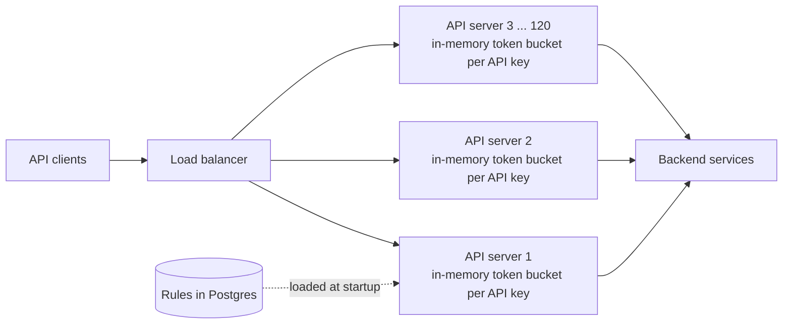

My rate limiter design:

```mermaid
flowchart LR
  C[API clients] --> LB[Load balancer]
  LB --> S1[API server 1<br/>in-memory token bucket per API key]
  LB --> S2[API server 2<br/>in-memory token bucket per API key]
  LB --> S3[API server 3 ... 120<br/>in-memory token bucket per API key]
  S1 --> B[Backend services]
  S2 --> B
  S3 --> B
  CFG[(Rules in Postgres)] -.->|loaded at startup| S1
```

- Limit: 1,000 requests/min per API key, bucket refills continuously
- Over the limit → 429
- No extra network hop, so it adds ~0 latency at 1M req/s
